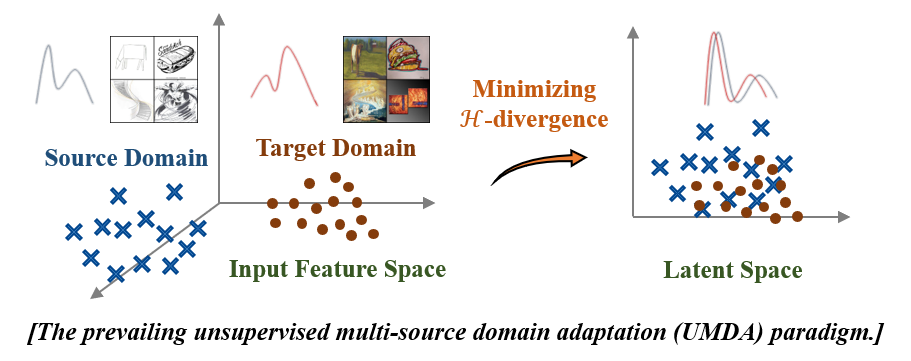

+++
title = 'Domain adaptation入门笔记（1.超基础知识篇）'
date = 2026-03-06T09:29:23+08:00
draft = false
tags = ["域适应", "笔记"]
math = true
+++
> - 本文为我入门域适应的一些随手记，按照时间顺序进行排序，包含了一些思考和反馈。
> - 摘录我阅读的文章原文部分使用*斜体*，关于思考总结的部分使用正常字体。 


## 第一次阅读
阅读材料：[迁移学习入门之一：域适应的背景，理论与方法](https://zhuanlan.zhihu.com/p/439560708)

在机器学习中，Domain Shift是一个很常见的问题，即在训练数据与真实场景来自于不同的分布。
*如在医学深度学习模型中，用A医院的数据(Source Domain)训练的模型往往在B医院(Target Domain)预测不准。在摄像头行人重识别(Re-ID)问题中，多个摄像头捕捉的场景分布完全不一致，导致单个行人在多个摄像头中的"重识别"变得较为困难。在联邦学习中，不同客户的数据分布不一致（non-iid）也是最常见的全局模型训练问题。*

而domain adaptation即是对于domain shift的一种解决方案。与其他流派（如迁移学习和微调）不同的点在于，domain adaptation保留了在source domain上的高精度，
并通过一些方法缩小表示空间（将数据从原始输入形式“如图像、文本”转换后得到的特征向量所在的抽象空间，在当前语境下，它是源域与目标域数据通过特征提取层映射后的空间）上Source与target模型特征的距离。



在了解大方向后，文章给出了一些数学推导，我感觉有点难以理解，这里先记录一些定义和简单的公式：

- ### 文章定义一个domain由两个部分组成：$D,f$

    1. **$D$（分布函数）**:可以理解为“画风“或数据长什么样。比如源域$D_S$是高清图，目标域$D_T$是高斯模糊图。
    2. **$f$（标签函数）**:是数据的标签，如在二分类问题中输入一张图$x$,它到底是猫还是狗（0或1）。

    在 Domain Adaptation 中，我们通常假设**物体的本质不变，只是画风变了**。
    也就是说，一张猫的图片，无论变多模糊，它依然是猫。也就是: 
    $f_S \approx f_T$, 但是 $D_s \neq D_T$

- ### 什么是误差？

    公式 ：
    $$ \epsilon(h, f; \mathcal{D}) = \mathbf{E}_{\mathbf{x} \sim \mathcal{D}}|h(\mathbf{x}) - f(\mathbf{x})| $$

    *   **$h$ (hypothesis，假设)**：学习函数，就是我们训练的模型网络。
    *   **$f$**：真实标签。
    *   **$\epsilon$ (error)**：误差。

    这个公式大概是代码里写的 **Loss 函数（或者说测试集上的错误率）**。
    它表示：在某种画风 $\mathcal{D}$ 下，你的模型 $h$ 预测的结果，和真实答案 $f$ 之间相差多少。
    *   $\epsilon_S(h)$：模型在源域（清晰图）上的错误率。
    *   $\epsilon_T(h)$：模型在目标域（模糊图）上的错误率。

    > 我们手里只有源域的标签，所以我们只能把 $\epsilon_S(h)$ 训练得很小。但我们**真正想要的是，$\epsilon_T(h)$ 也很小**。

- ### 关键公式：泛化误差上界

    $$ \epsilon_T(h) \le \epsilon_S(h) + d_1(\mathcal{D}_S, \mathcal{D}_T) + \text{常量} $$

    我们把这个公式拆成三块来看：
    你要想让**目标域错误率 $\epsilon_T(h)$ 很小**（等号左边），你必须让等号右边的三项都很小：

    1.  **$\epsilon_S(h)$**：源域的错误率。
        *   *代码体现*：将源域的Loss 降到最低。
    2.  **$d_1(\mathcal{D}_S, \mathcal{D}_T)$**：源域和目标域的**距离（画风差异）**。
        *   所有DA重点关注的模块。既然清晰图和模糊图有代沟，我们就在网络里加个模块，把他们的特征“拉近”，让这个距离 $d_1$ 变小。
    3.  **$\min\{...\}$ 项**：两个域标签函数的差异。
        *   我们通常假设猫就是猫，不管清不清晰，所以这部分是个很小的常数，通常被忽略。

- ### 如何衡量距离？从$d_1$ 到 $\mathcal{H}$-distance ：

    *   **$\mathcal{H}$-距离（公式4）**
        $$ d_{\mathcal{H}}(\mathcal{D}_S, \mathcal{D}_T) = 2 \sup_{h \in \mathcal{H}} |\Pr_{\mathcal{D}_S}(I(h)) - \Pr_{\mathcal{D}_T}(I(h))| $$
        > 这个公式有些复杂，所以我让Gemini帮我生成了详细的解释：

        #### 1. $I(h)$ 是什么？—— “VIP 准入名单”

        *   **文献里的原话**：$I(h) = \{\mathbf{x} : h(\mathbf{x}) = 1, \mathbf{x} \in \mathcal{X}\}$
        *   **【破壁机翻译】**：
            假设你的模型 $h$ 是一个“保安”（二分类器），它的任务是判断来的人是不是 VIP（输出 1 是 VIP，输出 0 不是）。
            那么，$I(h)$ 就是**所有被这个保安放行（判定为 1）的人的集合**。
        *   **💻 代码体现**：
            就相当于你在 PyTorch 里写了一句：
            `vip_group = x[model(x) == 1]`

        #### 2. $\Pr$ 是什么？—— “放行概率（命中率）”

        *   **符号含义**：$\Pr$ 就是 Probability（概率）。底下的下标 $\mathcal{D}_S$ 或 $\mathcal{D}_T$ 代表你是在哪个数据集里抓人。
        *   **【破壁机翻译】**：
            *   $\Pr_{\mathcal{D}_S}(I(h))$：你在**源域（比如：白天拍的照片）**里闭着眼睛瞎抓一张，这张照片**被模型判为 1** 的概率是多少？（假设是 30%）
            *   $\Pr_{\mathcal{D}_T}(I(h))$：你在**目标域（比如：黑夜拍的照片）**里闭着眼睛瞎抓一张，这张照片**被模型判为 1** 的概率是多少？（假设是 80%）
            *   $|\Pr_{\mathcal{D}_S} - \Pr_{\mathcal{D}_T}|$：取个绝对值，算出概率差（$|30\% - 80\%| = 50\%$）。
        *   **这个“差值”说明了什么？**
            如果同一个保安 $h$，对白天的人放行率是 30%，对黑夜的人放行率是 80%，差值很大，说明**这个保安（模型）对环境变化非常敏感（歧视严重）**。说明这两个数据集在保安眼里**差距很大**。

        #### 3. $\sup$ 是什么？—— “找茬大王（找最大值）”

        *   **符号含义**：`sup` 全称是 Supremum（上确界）。你可以简单粗暴地把它等同于 **$\max$（求最大值）**。
        *   **底下的 $h \in \mathcal{H}$**：$\mathcal{H}$ 代表你的“模型家族”（比如所有参数组合下的 ResNet18 模型）。
        *   **【破壁机翻译】**：
            现在，你手下有一万个保安（代表所有可能的模型参数组合 $h$）。
            `sup` 的意思就是：作为老板，你要对这一万个保安挨个进行测试，**专门挑出那个“双标最严重”、“对源域和目标域态度差异最大”的保安**。
            把这个“最能找茬的保安”找出的概率差，定义为这两个数据集的最终距离。

        ---

        #### 💡 连起来理解：什么是 $\mathcal{H}$-distance？

        现在我们把整个公式连起来读：

        > **两个数据集的 $\mathcal{H}$ 距离，就是我们在所有的模型（$\sup_{h \in \mathcal{H}}$）中，找到那个最能把这两个数据集区分开来的模型，它所表现出的“双标程度（概率差）”。**

        **为什么要这么定义？（高能预警，这联系到了深度学习的本质！）**

        你回想一下公式 (2) 的 $d_1$ 距离，那个距离是站在“上帝视角”找不同，太苛刻了。
        而公式 (4) 聪明就聪明在：它**把距离和模型绑定在了一起**。

        如果两个数据集（清晰图和模糊图），在物理像素上肯定不一样（上帝视角看距离很大）。
        **但是！**如果我们穷尽了所有的神经网络 $h$，连那个**“最会找茬的神经网络（sup）”**都发现：
        “哎？我怎么觉得清晰图里有 30% 是猫，模糊图里也有 30% 是猫？我完全感觉不到差别啊！”

        那就意味着：**在神经网络的视角下，这两个数据集的距离为 0！**

        #### 👨‍💻 最终落地：这在代码里怎么实现？（诞生了对抗域适应）

        理论家写出了 $\sup$（找最大差异），工程师怎么把它变成代码？

        **答案是：训练一个“域分类器（Domain Discriminator）”**。
        1.  我们写一个网络，专门去预测图片是来自源域（0）还是目标域（1）。
        2.  我们在训练这个分类器时，让它的 Loss 尽可能**小**（也就是让它尽可能把两边区分开，这就对应了数学上的 **$\sup$** 操作！）。
        3.  同时，我们让前面的 **Encoder** 特征提取器拼命去骗它，让域分类器的 Loss 尽可能**大**。

        **这就是著名的 GRL（Gradient Reversal Layer，梯度反转层） 算法，也就是对抗域适应的核心思想。**

> 接下来文章进入了严谨的公式推导，我实在有些不想看，刚好Gemini最后提到了代码实现的问题，还挺有意思的，那么我们就继续沿着这条线探索。


## 第二次阅读
阅读材料：与Gemini的对话。

在第一次阅读最后，我们从数学公式的定义转向具体的代码，现在我们通过和Gemini对话来深入。

### DANN（Domain-Adversarial Training of Neural Networks）
根据上文的笔记，我们知道域适应的主要数据集分为两种：源域（source）和目标域（target）。
基于此，DANN网络将结构分为三个模块：

1. **特征提取器（Encoder）**：主要用于提取两个域的特征。
2. **标签分类器（Label Classifier）**：基于提取的特征进行分类。
3. **域分类器 (Domain Discriminator)**：基于提取的特征判断输入的图片属于哪个域。

**冲突来了**：

- 域分类器的目标是高效识别两个域（也就是算出了那个最大的 H-distance）
- 而Encoder的目标则是模糊两个域的特征让域分类器无法识别。

如何提高Encoder“欺骗”的效率？这就引出了**GRL**。

### GRL（Gradient Reversal Layer）
在正常的神经网络中，反向传播（Backward）传回来的梯度（Gradient）是向着loss减小的方向进行的。
在**DANN**中，域分类器遵循这个规则，但对与Encoder则不一样。

Encoder目标是混淆两个域的区别，增大loss，而传统的反向传播会使loss减小，所以我们需要在loss前**乘上一个负号**，
于是，Encoder 拿着相反的梯度更新了参数，成功实现了**让 Loss 最大化**的目的。这就是GRL在网络中的作用。

### 代码实现(Gemini代写)：
**第一步：写出 GRL 的底层逻辑**：
```python
import torch
import torch.nn as nn
from torch.autograd import Function

# 自定义一个带反向求导规则的层
class GradientReversalLayer(Function):
    @staticmethod
    def forward(ctx, x, alpha):
        # 顺向传播：记住这个 alpha (反转系数，通常是 1)，然后原封不动地返回 x
        ctx.alpha = alpha
        return x.view_as(x)

    @staticmethod
    def backward(ctx, grad_output):
        # 反向传播：叛徒出现了！把传回来的梯度乘上负的 alpha
        output = grad_output.neg() * ctx.alpha
        # 第二个返回值是 None，因为 forward 里的 alpha 不需要求导
        return output, None

# 把这个魔法封装成一个普通的 nn.Module，方便我们像搭积木一样使用
class GRL(nn.Module):
    def __init__(self, alpha=1.0):
        super(GRL, self).__init__()
        self.alpha = alpha

    def forward(self, x):
        return GradientReversalLayer.apply(x, self.alpha)
```

**第二步：搭建 DANN 网络**:
```python
class DANN(nn.Module):
    def __init__(self):
        super(DANN, self).__init__()
        
        # 1. 伪造大师 (特征提取器 Shared Encoder)
        self.encoder = nn.Sequential(
            nn.Conv2d(3, 64, 3, padding=1),
            nn.ReLU(),
            nn.MaxPool2d(2)
        )
        
        # 2. 动物专家 (任务分类头 Task Head)
        self.label_classifier = nn.Sequential(
            nn.Linear(64 * 16 * 16, 128),
            nn.ReLU(),
            nn.Linear(128, 10) # 假设分 10 类动物
        )
        
        # 3. 海关警察 (域分类头 Domain Head)
        self.domain_classifier = nn.Sequential(
            nn.Linear(64 * 16 * 16, 64),
            nn.ReLU(),
            nn.Linear(64, 2) # 只分 2 类：0是源域(高清)，1是目标域(简笔画)
        )
        
        # 加入叛徒翻译官！
        self.grl = GRL(alpha=1.0)

    def forward(self, x):
        # 共同提取特征
        features = self.encoder(x)
        features_flat = features.view(features.size(0), -1)
        
        # 路线 A：正常去做分类任务
        class_preds = self.label_classifier(features_flat)
        
        # 路线 B：特征经过 GRL，再交给域分类器
        reversed_features = self.grl(features_flat)
        domain_preds = self.domain_classifier(reversed_features)
        
        return class_preds, domain_preds
```

**训练逻辑**：
```python
# 假设我们有清晰图数据 (Source) 和 模糊图数据 (Target)
criterion = nn.CrossEntropyLoss()

for (img_S, label_S), (img_T, _) in zip(source_loader, target_loader):
    # 把源域打上域标签 0，目标域打上域标签 1
    domain_label_S = torch.zeros(img_S.size(0), dtype=torch.long)
    domain_label_T = torch.ones(img_T.size(0), dtype=torch.long)
    
    # ---------------------------
    # 1. 训练源域 (Source)
    # ---------------------------
    class_preds_S, domain_preds_S = model(img_S)
    
    # 源域能算分类 Loss（因为有真实标签）
    loss_class = criterion(class_preds_S, label_S) 
    # 源域算域 Loss（警察要认出这是 0）
    loss_domain_S = criterion(domain_preds_S, domain_label_S)
    
    # ---------------------------
    # 2. 训练目标域 (Target)
    # ---------------------------
    class_preds_T, domain_preds_T = model(img_T)
    
    # 注意：目标域没有类别标签，所以不能算分类 Loss！
    # 目标域只能算域 Loss（警察要认出这是 1）
    loss_domain_T = criterion(domain_preds_T, domain_label_T)
    
    # ---------------------------
    # 3. 联合优化！
    # ---------------------------
    # 总 Loss = 分类误差 + (警察认出源域的误差 + 警察认出目标域的误差)
    total_loss = loss_class + (loss_domain_S + loss_domain_T)
    
    optimizer.zero_grad()
    total_loss.backward()
    optimizer.step()
```

当 `total_loss.backward()` 执行时，魔法发生了：
1. **对于 `domain_classifier`（警察）**：由于它在 GRL 之后，梯度正常流入，它会努力更新自己，让自己更聪明，把 Source 和 Target 分得更清。
2. **对于 encoder（伪造大师）**：当警察的梯度穿过 GRL 层传给它时，**乘上了负号**！于是 Encoder 努力更新自己，使得提取出来的特征，让警察**猜不出来**！

训练到最后的结果：
警察彻底疯了，它看所有特征都觉得是 50% 源域，50% 目标域。
这就意味着，Encoder 成功剔除了“画风（清晰还是模糊）”这个无关特征，只保留了“物体的本质”。
此时，拿目标域（模糊图）去给 label_classifier 预测，准确率就会暴涨！

## 反思
DANN作为一个经典网络，必然也会有它的短板：
- 全局对齐导致的负迁移 (Negative Transfer)：DANN 只对齐了**边缘分布 $P(X)$**，忽略了**条件分布 $P(Y|X)$**。
- 矫枉过正，Encoder会丢弃大量信息来模糊源域和目标域，导致分类效果直线下滑。
- 数据需求量大，DANN需要源域和目标域的数据，但现实中往往缺乏目标域的数据。

因此，后来的论文基于这三点进行改进，衍生出了四大方向：
- 带条件的对抗域适应 (CDAN, NIPS 2018)
- 伪标签技术 (Pseudo-labeling / Self-training)
- 熵最小化 (Entropy Minimization)
- 无源域适应 (Source-Free DA, SFDA)

> 这些方向基于三个问题点中的1～2个进行了深入研究和优化，具体深入就要通过读对应的论文了，入门笔记就到这里啦。


