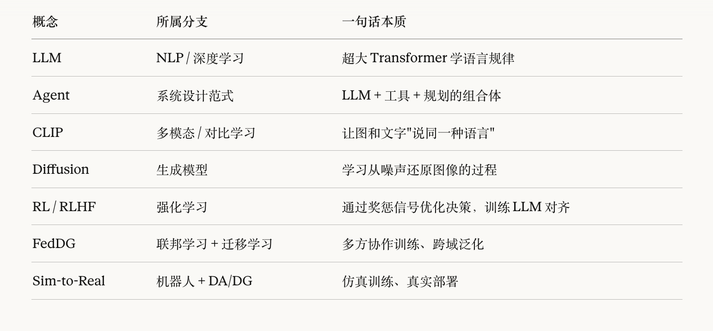

+++
title = 'Domain adaptation学习笔记（2.选择篇）'
date = 2026-03-07T19:00:54+08:00
draft = false
tags = ["域适应", "联邦域泛化", "研究方向", "强化学习", "LLM"]
series = ["联邦域泛化"]
math = true
+++

## 前言
经过基础知识的学习，我需要将视角放到更宏大的范围来寻找科研方向，了解整体风向，因此本篇笔记记录一些我摘录的当前学科架构的情况和我对于后续科研方向的一些探索。

## 人工智能领域结构
在了解到联邦域泛化（FedDG）后，我回顾了之前的学习历程，发现我对于人工智能领域的全景缺乏理解，所以我让Claude帮我进行快速回顾：
```text
人工智能 (Artificial Intelligence)
├── 机器学习 (Machine Learning)
│   ├── 监督学习 (Supervised Learning)
│   ├── 无监督学习 (Unsupervised Learning)
│   ├── 强化学习 (Reinforcement Learning)
│   └── 深度学习 (Deep Learning) ← 当前主流
│       ├── CV（计算机视觉）
│       ├── NLP（自然语言处理）← LLM 在这
│       ├── 多模态 (Multimodal)  ← CLIP 在这
│       └── 图神经网络 (GNN)
├── 知识表示 & 推理 (符号主义，老派)
├── 搜索与规划
└── 专家系统（已衰落）
```

而在所有的方向中，强化学习和深度学习无疑是最热门的方向，这里列出它们的内部结构：
### 深度学习
```text
深度学习
├── 模型架构
│   ├── CNN（图像）
│   ├── RNN/LSTM（序列，已被 Transformer 替代）
│   ├── Transformer ← 当代核心架构，LLM/CLIP/ViT 都用它
│   ├── GAN（生成对抗网络）
│   └── Diffusion Model（扩散模型，DALL·E、Stable Diffusion）
│
├── 训练范式
│   ├── 标准训练（i.i.d 假设，数据独立同分布）
│   ├── 迁移学习 Transfer Learning
│   │   ├── Fine-tuning（微调预训练模型）
│   │   ├── Domain Adaptation（DA）
│   │   ├── Domain Generalization（DG）← 我的方向
│   │   └── Prompt Tuning（提示微调）← CLIP 方向
│   ├── 自监督学习 Self-Supervised Learning（SSL）
│   │   └── 对比学习（SimCLR、MoCo）
│   ├── 元学习 Meta-Learning（"学会学习"）
│   │   └── MAML 等，FedDG 常借用
│   └── 联邦学习 Federated Learning
│       └── FedDG = 联邦学习 + 域泛化 ← 我的方向！
│
└── 应用方向
    ├── CV：分类、检测、分割、深度估计
    ├── NLP：问答、翻译、摘要
    ├── 多模态：图文对齐、VQA
    └── 机器人：感知、规划、控制
```
一些英文缩写的含义：



### 强化学习
```text
强化学习 (Reinforcement Learning)
│
├── 按"有没有环境模型"分
│   ├── 无模型 Model-Free RL          ← 主流，不需要理解环境规律
│   │   ├── 基于值函数 Value-Based
│   │   │   ├── Q-Learning（表格版，入门必学）
│   │   │   ├── DQN（Deep Q-Network，深度版）
│   │   │   └── Rainbow（DQN 的各种改进合集）
│   │   │
│   │   ├── 基于策略 Policy-Based
│   │   │   ├── REINFORCE（最基础的策略梯度）
│   │   │   └── PPO（Proximal Policy Optimization）← 工业界最常用
│   │   │
│   │   └── 演员-评论家 Actor-Critic（值+策略结合）
│   │       ├── A3C / A2C
│   │       ├── SAC（Soft Actor-Critic）← 机器人连续控制首选
│   │       └── TD3（Twin Delayed DDPG）
│   │
│   └── 基于模型 Model-Based RL        ← 样本效率高，但难建模
│       ├── Dyna（边学模型边用模型）
│       ├── MuZero（AlphaGo 的进化版）
│       └── Dreamer（在"梦境"里训练）
│
├── 按"动作空间"分
│   ├── 离散动作（上下左右跳）→ DQN 系列
│   └── 连续动作（关节角度）→ SAC / TD3 / PPO  ← 机器人在这
│
├── 特殊范式
│   ├── 多智能体 MARL（Multi-Agent RL）← 和联邦学习有交叉！
│   │   ├── 合作型（机器人团队协作）
│   │   └── 对抗型（博弈、竞技）
│   │
│   ├── 离线强化学习 Offline RL         ← 和 Source-Free 有类比！
│   │   └── 只用历史数据，不和环境交互（IQL、CQL）
│   │
│   ├── 模仿学习 Imitation Learning
│   │   ├── 行为克隆 BC（监督学习模仿专家）
│   │   └── GAIL（对抗式模仿，用 GAN 思想）
│   │
│   └── 逆强化学习 IRL（从行为反推奖励函数）
│       └── RLHF 就是它的变体！← LLM 训练用的
│
└── 深度强化学习 Deep RL（RL + 神经网络）
    └── 以上所有现代方法几乎都是 Deep RL
```
在真实的机器人场景中，RL面临这许多问题：
- 摔倒可能损坏硬件
- 真实世界 1:1 时间
- 一些物理描述（如“抓稳了”）怎么描述
- 传感器有噪声

基于这些问题，我让Claude给出解决方案概览：
```text
问题：样本效率低（真实机器人跑不起百万次）
  ↓ 解法
  ├── Model-Based RL（建模环境，减少真实交互）
  ├── Offline RL（用已有数据集，不再交互）
  └── Sim-to-Real（仿真里练好，迁移到真实）← 和你的方向直接相关！

问题：连续动作空间（关节角度是连续值）
  ↓ 解法
  └── SAC / TD3 / PPO（天然支持连续动作）

问题：奖励稀疏（只有"任务完成"才有奖励）
  ↓ 解法
  ├── 好奇心驱动探索（Intrinsic Curiosity Module）
  ├── 分层 RL（Hierarchical RL，大目标拆小目标）
  └── 模仿学习（先模仿人类示范，再 RL 精调）
```

## 方向探索
在了解完大致结构后，一些兴趣方向也大致锁定。目前我主要在思考三个方向：
- LLM领域 + FedDG（兴趣较大）
- 机器人领域 + FedDG（契合专业）
- 无源域适应（导师研究方向）

我主要针对方向一进行了细化：
### 结合LLM的FedDG
核心逻辑：利用大模型（主要是 CLIP 这种视觉-语言大模型）的强大泛化能力，来辅助联邦学习中的小模型去适应不同环境。

需要注意的是，LLM是大语言模型，与其说是LLM+FedDG，不如说是CLIP + FedDG。
> CLIP（Contrastive Language-Image Pretraining）是 OpenAI 用40亿张图文对训练出来的大模型。它最核心的能力是：
> 把图片和文字映射到同一个特征空间里。
> 比如，一张猫的照片和"a photo of a cat"这句话，经过 CLIP 处理后，它们的特征向量会非常接近。

我让Gemini帮我分析了切入点：

*   **切入点 A：联邦提示微调 (Federated Prompt Tuning)**
    *   **故事**：以前 FedDG 是在传模型的参数（Weight）。现在我们利用 CLIP，不调模型参数，而是**学一个“通用的提示词（Prompt）”**。
    *   **优势**：参数量极小（通信成本低），利用了 CLIP 见过几十亿张图的先验知识，泛化能力天然就很强。
    *   **关键词**：`Vision-Language Models`, `CLIP`, `Federated Prompt Learning`, `Text-guided DG`.

*   **切入点 B：LLM 生成数据增强 (Generative Data Augmentation)**
    *   **故事**：各个医院数据太少？我让 LLM 写 Prompt，指挥 Stable Diffusion 生成一堆“假的但很逼真”的医学图像，扩充本地数据。
    *   **优势**：简单粗暴有效，故事好听（AIGC for Science）。
    *   **关键词**：`Synthetic Data`, `Diffusion Models`, `Data Generation`.

> 在这个方向我通过和Claude的多次对话和提问总结了一份完整的论文导读，在这里不再赘述。

## 结语
在整理这篇笔记的过程中，我本来想将三个方向都进行细化整理，但是在重新阅读原始材料的过程中，我发现我对LLM领域有很大的兴趣，以至于第二遍阅读都没怎么看剩下两个方向。所以笔记整理就到第一个方向结束，但论文导读因为有Claude的帮助，完整总结了三个方向从入门到地基再到可优化的点，供未来的我参考。总的来说，总结过程中，未来努力的方向也越来越清晰，或许真的可以在科研中找到学习的乐趣吧。