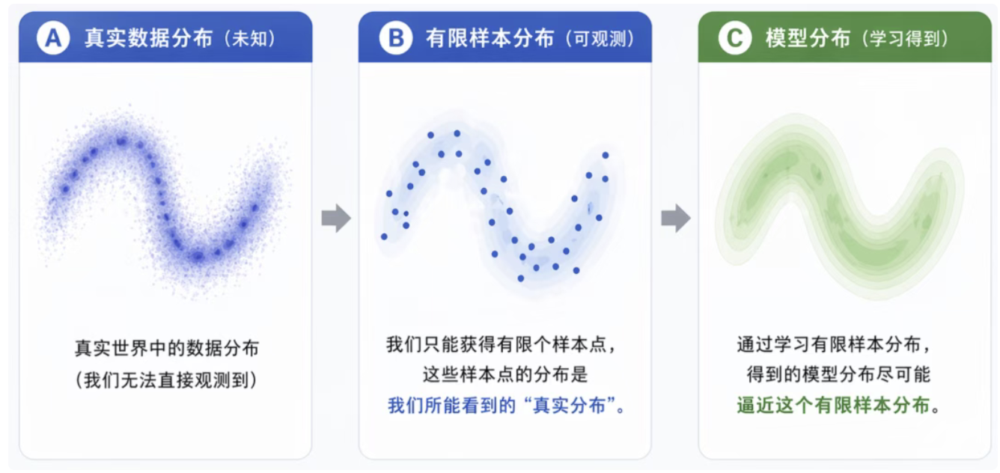
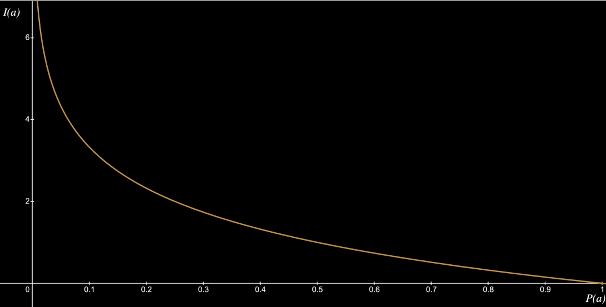
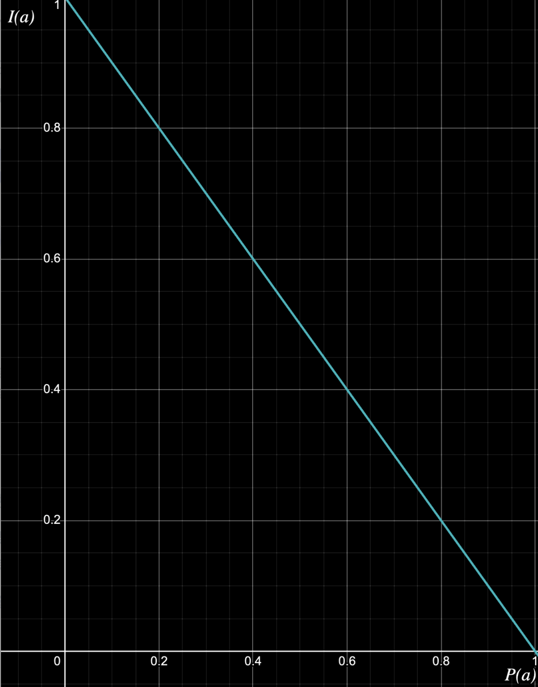
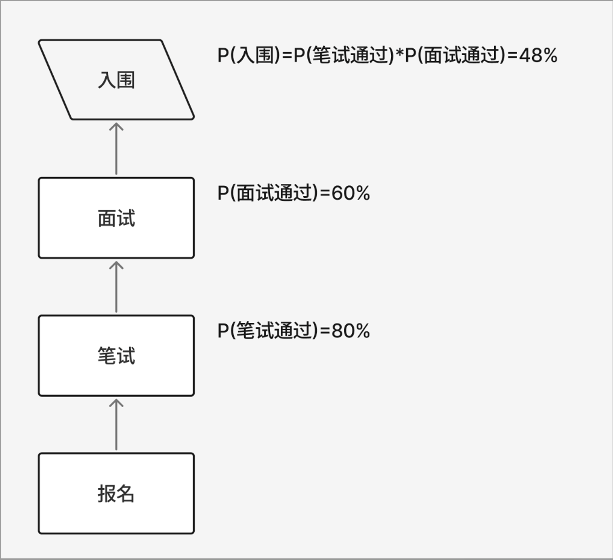
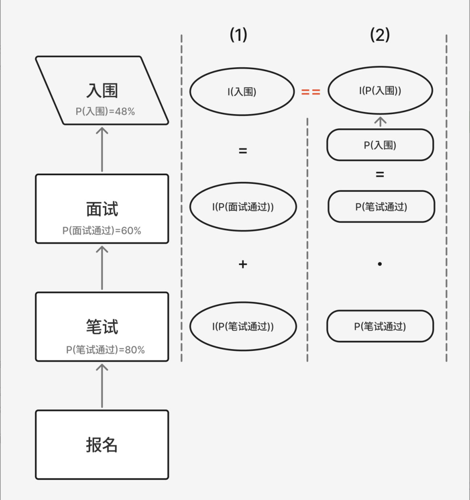
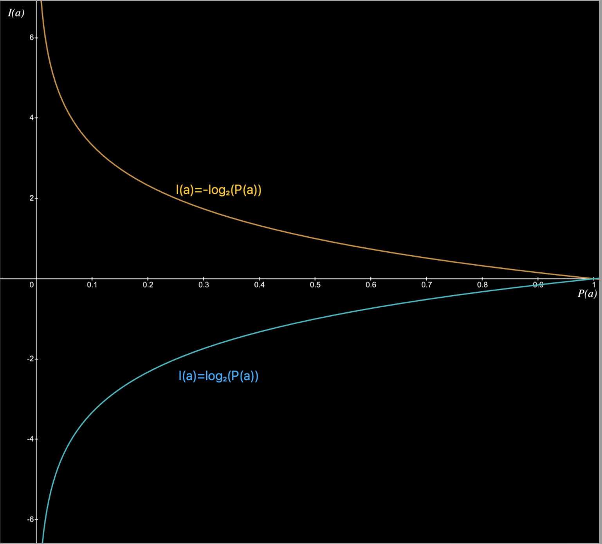
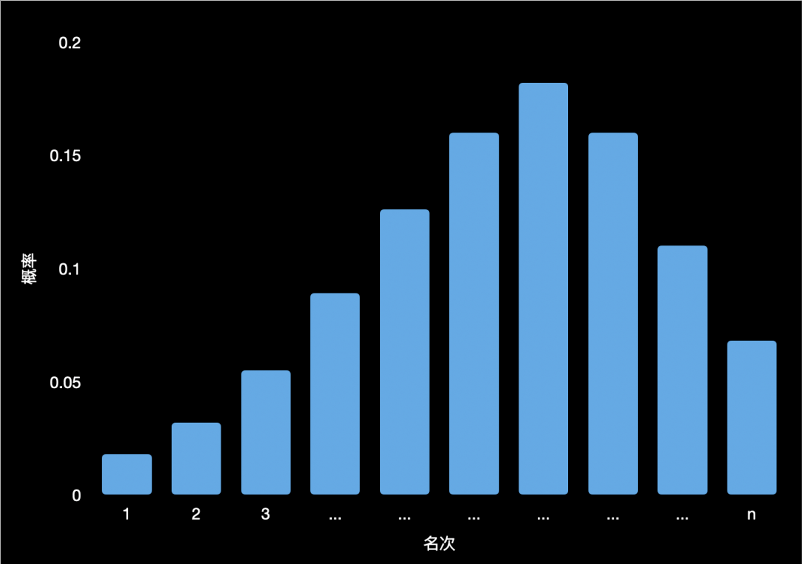
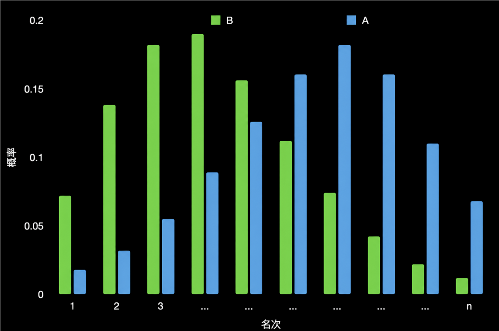

+++
title = "手撕损失函数：交叉熵（CE / BCE）"
date = 2026-07-11T00:00:00+08:00
draft = false
description = "从信息量、信息熵与 KL 散度出发，推导交叉熵，并梳理 BCE 与 CE 的区别。"
tags = ["深度学习", "损失函数", "交叉熵", "BCE", "CE"]
series = ["深度学习基础"]
math = true
+++

> 转载自公众号“浪猿”


# 引言

在机器和深度学习中，损失函数（*loss function*）是非常重要的概念，它的值（loss）定量表达了实际模型与理想模型的差异，而它的导数（梯度）又为模型更新提供了方向及大小。

交叉熵（Cross Entropy）损失函数是最经典也最常用的选择之一：从逻辑回归到深度神经网络，从二分类到多分类任务，都有它的身影。

本文将解析：

- 为什么需要损失函数
- 什么是信息量、什么是信息熵
- 什么是相对熵（KL 散度）
- 什么是交叉熵
- Binary Cross Entropy（BCE）和 Cross Entropy（CE）的区别

# 为什么需要损失函数

机器学习和深度学习的本质，是利用有限样本数据，学习一个「参数化模型」，使其概率分布尽可能逼近真实数据分布。



如何评估图上（C）模型分布与（B）有限样本分布是否相似呢？

这就需要损失函数（Loss Function），它用一个数值（损失函数的值：loss）来衡量模型预测结果与样本规律之间的差距，数值越小，说明模型越接近真实数据。

而交叉熵损失函数的值正是用来衡量两个概率模型的差异大小的。

# 什么是信息量、信息熵

## 什么是信息量

信息量用于衡量一个特定事件发生所带来的信息多少。

即一个事件发生的概率越小，它发生后带来的「信息量」就越大（比如“太阳从西边出来”比“太阳从东边出来”的信息量大得多）。

对于一个事件 $a$，发生概率为 $P_a$，信息量为 $I_a$，公式如下：

$$
I_a=-\log P_a
$$

它的函数图像如下：



> x 轴为 $a$ 事件发生的概率，y 轴为对应的信息量。

这时你是不是有个疑问，为什么使用 $-\log$ 函数来定义信息量？随便定义一个线性函数不是也可以嘛，例如以下线性函数，它也满足概率越小，它发生后带来的信息量就越大：

$$
I_a=1-P_a
$$



> $I_a=1-P_a$ 线性函数图。

这是因为信息量还需要满足另一个自治。

假设你正准备报考一个岗位，需要面试 + 笔试，如下图：



笔试通过发生概率 80%，面试通过发生概率 60%，入围发生概率就为 $0.8 \times 0.6=0.48$，很好理解吧？

我现在来考虑这个过程「信息量」的变化，我们假设还不知道「信息量」的定义，所以设一个 $X$ 函数来表示计算「信息量」的函数。

笔试通过的「信息量」为 $I_{\text{笔试通过}}$：

$$
I_{\text{笔试通过}}=X(P_{\text{笔试通过}})
$$

面试通过的「信息量」为 $I_{\text{面试通过}}$：

$$
I_{\text{面试通过}}=X(P_{\text{面试通过}})
$$

入围是笔/面试都通过，所以入围「信息量」$I_{\text{入围}}$：

$$
\begin{aligned}
I_{\text{入围}}
&=I_{\text{笔试通过}}+I_{\text{面试通过}}\\
&=X(0.8)+X(0.6)
\end{aligned}
$$

所以得到了入围的信息量公式 1：

$$
I_{\text{入围}}=X(0.8)+X(0.6)
$$

然后我们再换个角度考虑，我们不再根据每个过程计算信息量的和，而是直接使用入围的概率来计算入围的信息量：

$$
I_{\text{入围}}=X(P_{\text{笔试通过}}\cdot P_{\text{面试通过}})
$$

所以又得到了入围的「信息量」公式 2：

$$
I_{\text{入围}}=X(0.8\cdot0.6)
$$

根据“入围的信息量公式 1”（1）和“入围的信息量公式 2”（2），本质是相同的信息量的两条不同的计算路径：



如上图：

- （1）分别计算笔/面试的信息量后求和得到入围的信息量。
- （2）根据笔/面试概率得到入围的概率，并计算入围的信息量。

由（1）（2）公式得到信息量计算函数 $X$ 的一个特征公式（3）：

$$
\begin{aligned}
I_{\text{入围}}&=X(0.8)+X(0.6) &&(1)\\
I_{\text{入围}}&=X(0.8\cdot0.6) &&(2)\\
X(0.8\cdot0.6)&=X(0.8)+X(0.6) &&(3)
\end{aligned}
$$

根据公式（3），$X$ 函数可以排除线性函数了。而 $\log$ 函数正好满足这个要求（对数的乘法法则）：

$$
\log(x_1\cdot x_2)=\log x_1+\log x_2
$$

$$
x_1>0,\quad x_2>0
$$

相对的还有对数的除法法则，后面也会用到：

$$
\log\left(\frac{x_1}{x_2}\right)=\log x_1-\log x_2
$$

$$
x_1>0,\quad x_2>0
$$

所以 $\log$ 函数非常适合用来描述信息量。而 $\log$ 函数的值在负数区间，所以使用 $-\log$，如下图：



而通常使用以 2 为底的 $-\log$ 函数，是因为这样得到的「信息量」正好是有单位的，单位就是比特（bit），这是最常用的。我们可以把**bit** 想成“排除不确定性所需要的一次二选一判断”。当信息量定义为$I(a)=-\log_2 P(a)$时，结果的单位就是 **bit**。这里的 bit 是**信息量的单位**，衡量事件发生后，我们获得了多少信息，而不是单纯指计算机硬盘里的某一位 0 或 1。

例如抛一枚均匀硬币，“正面朝上”的概率是：

$$
P(\text{正面})=\frac{1}{2}
$$

它的信息量为：

$$
\begin{aligned}
I(\text{正面})
&=-\log_2\frac{1}{2}\\
&=1\ \text{bit}
\end{aligned}
$$

为什么正好是 1 bit？因为原来有“正面”和“反面”两个等可能结果，观察结果后，只需要回答一次二选一问题：

> 是正面吗？

一次二选一判断就消除了一半的不确定性，因此获得了 1 bit 信息。

再看一个概率为 $\frac{1}{4}$ 的事件：

$$
\begin{aligned}
I(a)
&=-\log_2\frac{1}{4}\\
&=2\ \text{bit}
\end{aligned}
$$

可以把它想成四个等可能选项：

```text
A、B、C、D
```

要确定是哪一个，理想情况下需要两次二选一判断：

```text
第一次：在 A、B 中，还是在 C、D 中？
第二次：具体是哪一个？
```

所以，从四个等可能结果中确定一个结果，获得的信息量是 2 bit。

同理：

$$
\begin{aligned}
P(a)=\frac{1}{2} &\Rightarrow I(a)=1\ \text{bit}\\
P(a)=\frac{1}{4} &\Rightarrow I(a)=2\ \text{bit}\\
P(a)=\frac{1}{8} &\Rightarrow I(a)=3\ \text{bit}
\end{aligned}
$$

概率每缩小一半，信息量就增加 1 bit。

更直观地说：

$$
2^n\text{ 个等可能结果}
\quad\Longrightarrow\quad
\text{确定其中一个结果需要 }n\text{ bit 信息}
$$

例如：

- 2 个等可能结果：1 bit
    
- 4 个等可能结果：2 bit
    
- 8 个等可能结果：3 bit
    
- 256 个等可能结果：8 bit
    

在信息论和计算机科学中，经常使用二进制，因此以 2 为底最直观。在深度学习的损失函数中，则更常使用自然对数 $\ln$，所以交叉熵的数值严格说是以 **nat** 为单位。不过训练模型时，改变对数底数只会给损失和梯度乘上一个固定常数，通常不会改变最优解。仅从数学角度来说底数可以为任意大于 0 且不等于 1 的实数。

了解了以上内容，我们用（1）（2）两个路径计算例子中“入围”带来的「信息量」：

$$
\begin{aligned}
I_{\text{入围}}
&=-\log_2 0.8+(-\log_2 0.6)\\
&\approx1.05889
\end{aligned}
\tag{1}
$$

$$
\begin{aligned}
I_{\text{入围}}
&=-\log_2(0.8\cdot0.6)\\
&\approx1.05889
\end{aligned}
\tag{2}
$$

所以“入围”事件发生后带来的「信息量」为 1.05889 bit。

## 什么是信息熵

「信息熵」用于衡量整个系统的不确定性，计算上是按照所有可能的信息量按概率加权（对期望的贡献）求和的值（即期望值）。是不是很拗口，不过没关系，我们还是以“报考岗位”的例子来理解。

1. 系统中所有可能，在报考岗位中就 2 种，“入围”和“未入围”，它们的概率 $P$：

$$
\begin{aligned}
P_{\text{入围}}&=0.48 &&(1)\\
P_{\text{未入围}}&=1-P_{\text{入围}}=0.52 &&(2)
\end{aligned}
$$

2. 每个可能的信息量 $I$：

$$
\begin{aligned}
I_{\text{入围}}
&=-\log_2 P_{\text{入围}}\\
&=-\log_2 0.48\\
&\approx1.0588
\end{aligned}
\tag{1}
$$

$$
\begin{aligned}
I_{\text{未入围}}
&=-\log_2 P_{\text{未入围}}\\
&=-\log_2 0.52\\
&\approx0.9434
\end{aligned}
\tag{2}
$$

3. 每个可能的对期望的贡献 $C$（信息量按概率加权）：

$$
\begin{aligned}
C_{\text{入围}}
&=P_{\text{入围}}\cdot I_{\text{入围}}\\
&=-0.48\cdot\log_2 0.48\\
&\approx0.5082
\end{aligned}
\tag{1}
$$

$$
\begin{aligned}
C_{\text{未入围}}
&=P_{\text{未入围}}\cdot I_{\text{未入围}}\\
&=-0.52\cdot\log_2 0.52\\
&\approx0.4906
\end{aligned}
\tag{2}
$$

4. 最后把每个可能的对期望的贡献求和得到报考岗位的「信息熵」$H$（即期望值）：

$$
\begin{aligned}
H_{\text{报考岗位}}
&=C_{\text{入围}}+C_{\text{未入围}}\\
&=0.5082+0.4906\\
&\approx0.9988
\end{aligned}
$$

所以“报考岗位”的信息熵为 0.9988 bit。

> 到这里读者可以修改下“入围”的概率，观察下不同“入围”概率的系统，它的信息熵的变化。并根据变化思考下「信息熵用于衡量整个系统的不确定性」这句话的含义。

再进一步考虑，如果“报考岗位”这个系统，不是只有“入围”和“未入围”两种结果，而是 $n$ 个名次呢？



> 比如“报考岗位”系统的名次和概率图。

这个系统的「信息熵」$H$ 就变成了：

$$
\begin{aligned}
H_{\text{报考岗位}}
&=C_1+C_2+\cdots+C_n &&(1)\\
&=\sum_{i=1}^{n}C_i &&(2)\\
&=\sum_{i=1}^{n}P_i\cdot(-\log_2P_i) &&(3)
\end{aligned}
$$

到这推导出了，一个有 $n$ 种可能的系统 $S$ 的「信息熵」$H(S)$ 的计算公式：

$$
H(S)=\sum_{i=1}^{n}P_i\cdot(-\log_2P_i)
$$

# 什么是相对熵（KL 散度）

假设有 A、B 两个概率系统如图：



如何衡量这 2 个系统的分布差异呢？这步非常重要，其实就是机器学习/深度学习中如何比较训练出来的模型分布与标注集分布的差异。

> 简单 A、B 两个系统的「信息熵」相减是不行的，因为「信息熵」相同的两个概率系统分布不一定一样。这就类似于 2 个班级平均成绩一样，但是成绩分布有可能是不同的。它无法体现分布的差别。

这就要用到相对熵（KL 散度）：

用一个分布 $P_B$ 去近似另一个真实分布 $P_A$ 时，所损失的信息量或产生的差异。

它的定义：

$$
D_{KL}(P_A\|P_B)
=\sum_{i=1}^{n}P_{Ai}\cdot\log_2\frac{P_{Ai}}{P_{Bi}}
$$

> 注意这里的我们把 A 系统定为标准，也就是用作标准的那个系统写在符号的前面。

如果上面的公式很难记，我们先看下这 A、B 两个系统的「信息熵」以及「相对熵」的公式比较，就比较好记了。

$$
H_A=\sum_{i=1}^{n}P_{Ai}\cdot(-\log_2P_{Ai})
\tag{A}
$$

$$
H_B=\sum_{i=1}^{n}P_{Bi}\cdot(-\log_2P_{Bi})
\tag{B}
$$

$$
D_{KL}(P_A\|P_B)
=\sum_{i=1}^{n}P_{Ai}\cdot\log_2\frac{P_{Ai}}{P_{Bi}}
\tag{D}
$$

仔细比较上面的公式，「相对熵」其实就是用：

A 系统 $i$ 事件的概率（$P_{Ai}$）除以 B 系统 $i$ 事件的概率（$P_{Bi}$）后取对数，再使用 A 系统 $i$ 事件发生的概率（$P_{Ai}$）加权，再对 $n$ 个事件求和。

这完美体现了相对熵的「相对」和「熵」两个词的含义。

在这里需要注意「相对熵」的一个特点，这是由「吉布斯不等式」推导而来，这里只需要记住这个特性：

$$
D_{KL}(P_A\|P_B)\ge0
$$

相对熵越小，B 系统的分布越接近 A 系统，为 0 时 A、B 两系统分布相同。

看上去「相对熵」已经是模型训练需要的比较算法了：

- A 系统就是标注的数据
- B 系统就是训练出来的模型
- 最小化 $D_{KL}(P_A\|P_B)$ 的值就可以让训练的模型接近标注数据分布

使「相对熵」最小化确实是可以使用的，但是那些数学大佬哪有这么容易满足呢？他们一定会把这个算法优化到极致，这就引出了交叉熵。

# 什么是交叉熵

我们已经知道了相对熵：

$$
D_{KL}(P_A\|P_B)
=\sum_{i=1}^{n}P_{Ai}\cdot\log_2\frac{P_{Ai}}{P_{Bi}}
$$

对这个公式进行变形，根据对数除法法则：

$$
\begin{aligned}
D_{KL}(P_A\|P_B)
&=\sum_{i=1}^{n}P_{Ai}\cdot\log_2\frac{P_{Ai}}{P_{Bi}}\\
&=\sum_{i=1}^{n}P_{Ai}\cdot(\log_2P_{Ai}-\log_2P_{Bi})
\end{aligned}
$$

继续对上一个结果的公式变形：

$$
\begin{aligned}
\sum_{i=1}^{n}P_{Ai}\cdot(\log_2P_{Ai}-\log_2P_{Bi})
&=\underbrace{\sum_{i=1}^{n}P_{Ai}\cdot\log_2P_{Ai}}_{p_1}
-\underbrace{\sum_{i=1}^{n}P_{Ai}\cdot\log_2P_{Bi}}_{p_2}
\end{aligned}
$$

现在相对熵的公式变成两部分之和：

$$
-H(A)=\sum_{i=1}^{n}P_{Ai}\cdot\log_2P_{Ai}
\tag{$p_1$}
$$

$$
H(P_A\|P_B)=-\sum_{i=1}^{n}P_{Ai}\cdot\log_2P_{Bi}
\tag{$p_2$}
$$

观察上面的公式 $p_1$，是不是就是系统 A 的信息熵乘以 $-1$？我们把它记做 $-H(A)$，而公式 $p_2$ 记做 $H(P_A\|P_B)$：

$$
D_{KL}(P_A\|P_B)=-H(A)+H(P_A\|P_B)
$$

注意 A 系统在训练时是我们的标注集合的分布，所以它的信息熵 $H(A)$ 是个常数，那 $-H(A)$ 自然也是常数，我们设这个常数为 $K$：

$$
\begin{aligned}
D_{KL}(P_A\|P_B)&=K+H(P_A\|P_B) &&(1)\\
D_{KL}(P_A\|P_B)&\ge0 &&(2)
\end{aligned}
$$

训练模型时目标是使 $D_{KL}(P_A\|P_B)$ 最小化，因为 $K$ 是常数且 $D_{KL}(P_A\|P_B)\ge0$，这样只需要让 $H(P_A\|P_B)$ 最小化就行了。

而这个 $H(P_A\|P_B)$ 就是主角「交叉熵」：

$$
H(P_A\|P_B)
=-\sum_{i=1}^{n}P_{Ai}\cdot\log_2P_{Bi}
$$

> 所以在训练模型时，不需要计算完整的「相对熵」，只需要计算「相对熵」里「交叉熵」那部分就可以了。

# BCE 和 CE 的区别

BCE（Binary Cross Entropy）就是「二元交叉熵」，在前面举“报考岗位”的例子中，只有“入围”和“未入围”两种结果时就可以使用「二元交叉熵」，它是「交叉熵」的一种特殊情况。有很多模型都是这样任务，比如判断一张图片里面的动物是不是猫，它只有“是”或者“不是”两种情况。

「二元交叉熵」因为两种事件是「对立事件」，所以公式是可以简化的，条件：

$$
\begin{aligned}
n&=2 &&\text{（两种事件）}\\
P_{A1}&=p_A &&\text{（A 事件 1）}\\
P_{A2}&=1-p_A &&\text{（A 事件 2）}\\
P_{B1}&=p_B &&\text{（B 事件 1）}\\
P_{B2}&=1-p_B &&\text{（B 事件 2）}
\end{aligned}
$$

进行简化推导：

$$
\begin{aligned}
H(P_A\|P_B)
&=-\sum_{i=1}^{2}P_{Ai}\cdot\log_2P_{Bi}\\
&=-[P_{A1}\cdot\log_2P_{B1}+P_{A2}\cdot\log_2P_{B2}]\\
&=-[p_A\cdot\log_2p_B+(1-p_A)\cdot\log_2(1-p_B)]
\end{aligned}
$$

这里需要注意的是，在模型训练时，A 系统是标注数据，所以 $p_A$ 实际上只有“是”和“否”两种，也就是：

$$
p_A\in\{0,1\}
$$

而 $p_B$ 是预测的概率，也就是：

$$
p_B\in(0,1)
$$

于是又可以简化下，这次使用 $H_b(P_A\|P_B)$ 表示二元的情况：

$$
H_b(P_A\|P_B)=
\begin{cases}
-\log_2(1-p_B), & \text{if }p_A=0\\
-\log_2(p_B), & \text{if }p_A=1
\end{cases}
$$
