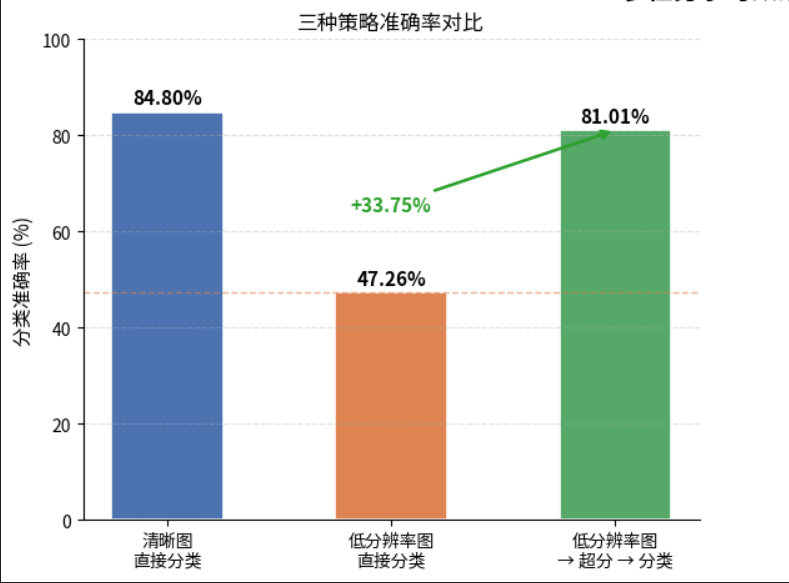
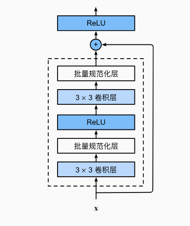

+++
title = "深度学习入门：PyTorch零基础到多任务联合微调"
date = 2026-02-26T18:39:55+08:00
draft = false
description = "基于超分辨率特征增强的图像分类多任务学习"
tags = ["项目实践", "PyTorch", "计算机视觉", "多任务学习", "超分辨率"]
+++
## 前言
该文章是基于我校 校科学技术协会 woc-python组题目个人解答过程的系统性回顾。

项目代码：[NJUPT-SAST-Python-WoC-2025](https://github.com/tianye-J/NJUPT-SAST-Python-WoC-2025.git)

> 本文主要记录学习和方法迭代的过程，详细代码实现请查阅代码库。

### 题目简介：
1. **任务背景与目标**

    本项目旨在探索多任务学习 (Multi-Task Learning) 在计算机视觉中的应用。核心目标是通过联合网络的设计，实现底层视觉（图像重构）与高层视觉（语义理解）两个任务的相互促进 (Mutual Promotion)。

2. **基础任务定义 (Single-Task Baselines)**
    
    网络需从零开始搭建与训练,完成以下两个独立任务：
    ```text
        Task 1：底层图像恢复 (Low-level Vision)
        任务内容：任选一种退化图像修复场景（包括但不限于超分辨率、去噪、去雾、低光增强等）。
        评估指标：PSNR 与 SSIM，需在验证集上具有合理表现。
        
        Task 2：高层图像分类 (High-level Vision)
        任务内容：基于 CIFAR 数据集的图像分类。
        评估指标：Accuracy（最低要求界定为 60%）。
    ```
3. **多任务联合优化约束 (Multi-Task Constraints)**

    在跑通单任务 Baseline 后，需构建多任务联合网络（例如 Task 1 辅助 Task 2，或反之），且必须满足以下硬性约束：
    ```text
    1.架构轻量化与一致性：多任务分支需与单任务网络结构保持高度一致，禁止大幅增加参数量。
    2.鼓励采用参数共享 (Parameter Sharing) 或引入轻量的交互通信模块。
    3.微调策略 (Fine-tuning)：在单任务预训练的基础上，通过微调分支头或特征层来实现融合。
    4.损失函数创新：鼓励设计具有创新性的互促损失函数 (Mutual-promoting Loss) 来平衡两个任务的梯度。
    ```

### 最终效果：

- 在 *低清图直接分类* 和经过多任务学习后 *超分->分类* 的结果对比中，后者正确率达到81.01%，而前者只有47.26%，多任务学习将图像分类的正确率**提升约0.7倍！**


> 让我们回到一切的开始，详细聊聊从无到有的过程吧。

---
## 一、破冰与镇痛
时间回到2025年的12月底，那时的我正处在迷茫与焦虑之中：大一的第一学期即将收官，但是自己仍未找到深耕的学习方向。在咨询班主任和高强度上网冲浪后
，我决定先入门人工智能，再以此为基础学习现代的机器人算法。与此同时，我一直期待的校科协WOC（Winter of Code）也即将举行，我便打算以此作为我入门人工智能的第一个项目。

在课题公布的最开始，我从未了解过pytorch，也从未使用过Jupyter，甚至对于机器学习、深度学习、神经网络等概念之间的从属关系也傻傻分不清。
于是，当务之急就是恶补这些基础知识。当时我正在通过[CS61A](https://cs61a.org/)(一门很好的计算机语言入门课程，墙裂推荐！)学习python语法，
由于时间紧迫，就囫囵吞枣地把后面关于类(class)的课时刷了一遍（现在来看不扎实的基础知识更加拖慢了后面学习的效率）。
刷完语法，我就开始物色课时短，又好评如潮的深度学习课程，最后，我决定在b站看《pytorch深度学习实践》。这门视频课系列完整地从全连接神经网络讲到现代的卷积和循环神经网络模型，注重代码实践的风格也帮我更快的理解和上手实践。唯一的缺点就是没有教transformer架构，这可能也是为什么课时短的原因吧:)

不得不提的是，神经网络的学习让我第一次对代码到底如何从计算实现一个大功能有了真实的体验，Thanks~
  

## 二、task1/task2的探索
折腾完基础知识的学习，时间也已经来到了一月底。
可惜的是，假期的开始并没有让我有许多时间投入深度学习的学习（读起来好怪hhh）,
我被拉入了托福课的泥潭，每天自己学习的时间只有晚上可怜的两三个小时。幸亏有gemini和claude，可以~~直接vibe coding~~。

### task2初试
对于一个初学者，task2相比task1可以更好上手。所以我决定先写一个最基础的二层卷积->下采样->三层全连接的网络，跑通一遍再说！
```python
#定义模型
class Net(nn.Module):
    def __init__(self):
        super(Net, self).__init__()
        # CIFAR10 输入: (batch, 3, 32, 32)
        self.conv1 = nn.Conv2d(3, 16, kernel_size=5)
        self.conv2 = nn.Conv2d(16, 32, kernel_size=5)
        self.pool = nn.MaxPool2d(2, 2)
        self.fc1 = nn.Linear(32 * 5 * 5, 120)
        self.fc2 = nn.Linear(120, 84)
        self.fc3 = nn.Linear(84, 10)
    
    def forward(self, x):
        x = self.pool(F.relu(self.conv1(x)))
        x = self.pool(F.relu(self.conv2(x)))
        x = x.view(-1, 32 * 5 * 5)  # 展平
        x = F.relu(self.fc1(x))
        x = F.relu(self.fc2(x))
        x = self.fc3(x)
        return x

#损失函数和优化器
criterion = nn.CrossEntropyLoss()
optimizer = optim.SGD(model.parameters(), lr=learning_rate, momentum=momentum)
```
这套我在minst识别中就使用的方案居然在cifar10上跑出了60+%的准确率，已经达到了课题的要求!

当然，这套方案存在一些缺点：

    1. 卷积层太少、kernel太大，特征提取能力太差（正确率只有60+的核心问题）
    2. 非常容易过拟合，上限锁死

不过秉持着‘先跑通一遍’的原则，我决定先把优化的事放一放，先进入task1的学习。

### task1初试
课题中给了很多task1的选择方向（超分辨率、去噪、去雾、低光增强等），经过gemini（哈基米老师真的很好）的介绍和推荐，我决定搭建超分辨率(Super-Resolution)架构。

- **关于数据集**

    对于task1需要的数据集，训练数据集我选择了[DIV2K](https://data.vision.ee.ethz.ch/cvl/DIV2K/)，测试数据集选择了[Set14](https://huggingface.co/datasets/eugenesiow/Set14)。DIV2K包含800张2k超清摄影图，很好的适配了超分辨率的训练需求。Set14是14张不同风格的图片（有摄影，也有海报等），图片数量少，测试快；种类多，也能测试模型的泛化能力。准备好数据集，我们就可以进入模型搭建环节啦！


超分辨率，或是说这种底层视觉任务，超出了我之前的学习范围，同时又因为每天学习时间碎片化，一些基础知识忘的差不多了，我需要先停下代码进度，回去复习。

复习的时候，我遇到了另一个非常全面的入门资料：由李沐老师编写的[动手学深度学习](https://zh.d2l.ai/)。复习期间我浏览了其中现代卷积神经网络部分，其中VGG,ResNet对我后续优化起了很大的帮助。

由于超分辨率是一个细分的分支，市面上并没有一个全面的入门教材，阅读综述就成了入门的唯一方式。在浏览完一个大概的入门综述（[综述地址](https://zhuanlan.zhihu.com/p/558813267)）后，我决定以SRCNN（[论文地址](https://arxiv.org/pdf/1501.00092)）作为我的基础骨架。

- **关于SRCNN**

    SRCNN作为超分辨率的开山之作,在今天来看其技术架构非常简单易懂，适合入门和个性化改进，其主要有以下几个问题需要改进：
    
    1. 它只能对相同倍数的图像进行超分，需要重新调整网络参数并训练来实现不同尺寸的超分。
    2. 采用的插值方法将LR图像转换到HR图像空间，再利用神经网络重建，这增加了网络计算量。
    3. 网络浅，提取特征能力不强。

确定好了基础架构和先先需要改进的问题，第一版模型也就应运而生：
```python
class Net(nn.Module):
    def __init__(self, *args, **kwargs) -> None:
        super().__init__(*args, **kwargs)

        #Encoder
        self.encoder = nn.Sequential(
            nn.Conv2d(3, 64, kernel_size=9, padding=4),
            nn.ReLU(inplace=True),
            nn.Conv2d(64, 32, kernel_size=5, padding=2),
            nn.ReLU(inplace=True),
            nn.Conv2d(32, 32, kernel_size=3, padding=1),
            nn.ReLU(inplace=True)
        )

        #上采样部分
        self.upsample = nn.Sequential(
            nn.Conv2d(32, 32*4, kernel_size=3, padding=1),
            nn.PixelShuffle(upscale_factor=2),
            nn.Conv2d(32, 3, kernel_size=3, padding=1),
            nn.Sigmoid()
        )

    def forward(self, x):
            x = self.encoder(x)
            x = self.upsample(x)
            return x

criterion = nn.MSELoss()
optimizer = optim.Adam(model.parameters(), lr=lr)  
```
该模型的主要改进：
1. 增加深度（SRCNN的3层卷积->5层卷积）
2. 动态调整卷积核的大小（9->5->3）
3. 将SRCNN中采用的插值方法改为Pixelshuffle亚像素卷积放大，简化计算流程
4. 优化器采用流行的Adam架构

需要补充的是，受限于设备，训练时每一张图片只能取一小块喂给模型，这样才能保证每个batch的数据量足够多。
具体表现在Dataset之中：
```python
class DIV2KDataset(Dataset):
    def __init__(self, root_dir, crop_size=128, scale_factor=2) -> None:
        super().__init__()
        self.root_dir = root_dir
        self.image_files= [f for f in os.listdir(root_dir)]

        self.crop_size = crop_size          #裁剪为crop_size**2大小的图像
        self.scale_factor = scale_factor    #缩小scale_factor倍

        #处理高清图片
        self.transforms_HR = transforms.Compose([
            transforms.RandomCrop(crop_size),
            transforms.ToTensor(),
        ])

        #生成低清图片
        self.transforms_LR = transforms.Resize(
            size=(crop_size // scale_factor, crop_size // scale_factor),
            interpolation=transforms.InterpolationMode.BICUBIC  #双三次插值
        )

        def __len__(self):
            return len(self.image_files)
        
        def __getitem__(self, idx):

            #拼出图片路径并打开
            img_path = os.path.join(self.root_dir, self.image_files[idx])
            image = Image.open(img_path).convert('RGB')

            #制作训练样本
            img_HR = self.transform_HR(image)
            img_LR = self.transform_LR(img_HR)

            return img_LR, img_HR

```
> Dataset类在转换图片为张量的基础上，额外增加了切片制作训练样本的过程。
    灵感来源：gemini💁

最终第一版的模型的跑分为：
- PSNR：26.93
- SSIM：0.8303

这一版模型能力还是比较高的（在设备的限制下），也达到了课题验收的要求。但是在之前简单的复习后，一些新的架构和想法在我脑中跃跃欲试，于是，我很快进入优化阶段：

## 三、独立模型的优化
### task2
还是按照时间顺序，先说task2。在刚开始优化的时候，我尝试过增加模型的深度，
包括增加卷积和全连接层、调整卷积核大小，但越是改动，一个问题就越来越明显：**过拟合**。一味增加深度不仅拉长了一次训练的时间，而且模型过度记忆训练集的特征，正确率进入了难以突破的瓶颈：训练集达到80%的准确率，但测试集正确率却险些跌破60%。

过拟合是在模型深度增加时难免遇到的问题，得益于李沐老师的书，我找到了一个简单有效的方法：**Dropout**。
Dropout方法通过在训练过程中随机丢弃一些神经元，从而预防了模型过度记忆训练集的特征，提高模型的泛化能力。
有了Dropout，模型适当的深度增加所带来的正反馈也得到了加强。

于是，最终的 **CIFAR10分类模型** 就完成了：
```python
#encoder
class Encoder(nn.Module):
    def __init__(self):
        super().__init__()
        self.features = nn.Sequential(
            nn.Conv2d(3, 64, kernel_size=3, padding=1),
            nn.ReLU(inplace=True),
        )

    def forward(self, x):
        return self.features(x)

# Task2: 分类网络
class Net(nn.Module):
    def __init__(self):
        super(Net, self).__init__()
        self.encoder = Encoder()

        self.conv2 = nn.Conv2d(64, 64, kernel_size=3, padding=1)
        self.conv3 = nn.Conv2d(64, 64, kernel_size=3, padding=1)
        self.conv4 = nn.Conv2d(64, 64, kernel_size=3, padding=1)
        self.conv5 = nn.Conv2d(64, 128, kernel_size=3, padding=1)
        self.conv6 = nn.Conv2d(128, 128, kernel_size=3, padding=1)
        self.pool = nn.MaxPool2d(2, 2)

        self.fc1 = nn.Linear(128 * 4 * 4, 256)
        self.fc2 = nn.Linear(256, 128)
        self.fc3 = nn.Linear(128, 10)

        self.dropout_conv = nn.Dropout(0.25)
        self.dropout_fc = nn.Dropout(0.5)
    
    def forward(self, x):
        x = self.encoder(x)

        x = F.relu(self.conv2(x))
        x = self.pool(x)
        x = self.dropout_conv(x)

        x = F.relu(self.conv3(x))
        x = F.relu(self.conv4(x))
        x = self.pool(x)
        x = self.dropout_conv(x)

        x = F.relu(self.conv5(x))
        x = F.relu(self.conv6(x))
        x = self.pool(x)
        x = self.dropout_conv(x)

        x = x.view(-1, 128 * 4 * 4)
        x = F.relu(self.fc1(x))
        x = self.dropout_fc(x)
        x = F.relu(self.fc2(x))
        x = self.dropout_fc(x)
        x = self.fc3(x)
        return x

criterion = nn.CrossEntropyLoss()
optimizer = optim.SGD(model.parameters(), lr=lr, momentum=momentum)
```
经过优化的模型在测试集和训练集的准确率相当，最终跑分：
- 训练集：89%（有几次越过90%）
- 测试集：85%

这是在清晰的图片下的训练结果，这个测试的准确率也决定了模型在多任务学习中准确率的上限（毕竟我的超分辨率模型怎么优化也超不过原图的清晰度（悲））。

### task1

SRNet的改动相对来说就复杂许多，首先我想到的改进就是引入**残差块(Res_blocks)**。

这个架构可以说是在计算机视觉中家喻户晓的存在。Residual-block通过跳跃连接的方式解决了梯度消失的问题，保证了初始特征在多轮训练中的稳定。简要示意图如下（[图片来源](https://zh.d2l.ai/chapter_convolutional-modern/resnet.html)）：



以下为修改后的模型代码：
```python
#Encoder
class Encoder(nn.Module):
    def __init__(self):
        super().__init__()
        self.features = nn.Sequential(
            nn.Conv2d(3, 64, kernel_size=3, padding=1),
            nn.ReLU(inplace=True),
        )

    def forward(self, x):
        return self.features(x)

#定义模型
class Net(nn.Module):
    def __init__(self, num_channels=128, num_residual_blocks=8) -> None:
        super().__init__()

        self.encoder = Encoder()

        self.transition = nn.Sequential(
            nn.Conv2d(64, num_channels, kernel_size=3, padding=1),
            nn.ReLU(inplace=True),
        )

        res_blocks = []
        for _ in range(num_residual_blocks):
            res_blocks.append(nn.Sequential(
                nn.Conv2d(num_channels, num_channels, kernel_size=3, padding=1),
                nn.ReLU(inplace=True),
                nn.Conv2d(num_channels, num_channels, kernel_size=3, padding=1),
            ))
        self.res_blocks = nn.ModuleList(res_blocks)
        self.res_relu = nn.ReLU(inplace=True)

        #特征压缩
        self.tail = nn.Sequential(
            nn.Conv2d(num_channels, 64, kernel_size=3, padding=1),
            nn.ReLU(inplace=True),
        )

        #上采样部分
        self.upsample = nn.Sequential(
            nn.Conv2d(64, 64*4, kernel_size=3, padding=1),
            nn.PixelShuffle(upscale_factor=2),
            nn.Conv2d(64, 3, kernel_size=3, padding=1),
            nn.Sigmoid()
        )

    def forward(self, x):
        x = self.encoder(x)
        x = self.transition(x)
        for block in self.res_blocks:
            x = self.res_relu(x + block(x))
        x = self.tail(x)
        x = self.upsample(x)
        return x
```
除残差块外，模型还进行了以下修改：

1. **将Encoder独立**：这里的Encoder和task2的分类网络共享了同一个结构（`Conv2d(3, 64, 3, padding=1)`），这是为了适应多任务学习部分的参数共享而做出的调整。
2. **引入transition层**：将Encoder输出的64通道扩展到128通道，为残差块提供更宽的特征空间。
3. **8个残差块**：每个残差块由两层卷积组成，通过跳跃连接（`x + block(x)`）保持梯度稳定。8个残差块意味着网络的主干深度达到了16层卷积，特征提取能力远超第一版。
4. **特征压缩（tail）**：残差块输出后通过tail层将128通道压缩回64通道，再送入上采样模块，保持了PixelShuffle部分的计算效率。
5. **统一卷积核为3×3**：抛弃了第一版中9→5→3的递减策略，全部使用3×3小卷积核，通过深度来弥补感受野，这也是VGG论文中的经典结论。

除了架构上的改动，训练策略也做了调整：

```python
criterion = nn.L1Loss()
optimizer = optim.Adam(model.parameters(), lr=0.001)
scheduler = optim.lr_scheduler.StepLR(optimizer, step_size=25, gamma=0.7)
```

- **L1Loss替代MSELoss**：MSE对大误差的惩罚过重，容易让模型生成过于平滑的图像。L1Loss对误差的处理更加均匀，生成的图像细节更锐利。
- **学习率调度器（StepLR）**：每25个epoch将学习率乘以0.7，在训练后期自动降低学习率帮助模型更精细地收敛，避免在最优解附近来回震荡。

最终版SRNet在Set14上的跑分：
- PSNR：28.15
- SSIM：0.8912

如果但从分数上看，模型的提升相对task2没有那么明显，或许是调整过重，或许是发力错了方向，我个人对于调整过后的分数并不是那么满意。不过作为一个底层视觉优化的模型，一点小的提升相信对与分类器来说也是很不错的加持了。

---

## 四、多任务学习

经过两个独立模型的提升优化，是时候进行联合训练环节了！


### 设计思路

回顾课题要求：多任务网络需要让底层视觉（超分辨率）和高层视觉（分类）两个任务**相互促进**。我的设计思路是：先用超分辨率网络将模糊图像修复，再将修复后的清晰图像送入分类网络进行分类。直觉上来说，分类网络面对一张经过超分增强的图片，理应比面对一张糊成一团的低分辨率图片表现更好。

整体流程可以概括为：**模糊图片 → SR修复 → 归一化 → 分类**


```python
class MultiTaskNet(nn.Module):
    def __init__(self):
        super().__init__()
        self.sr = SRNet()
        self.classifier = ClassifyNet()
        self.normalize = transforms.Normalize(
            (0.4914, 0.4822, 0.4465),
            (0.2023, 0.1994, 0.2010)
        )

    def forward(self, x):
        sr_out = self.sr(x)
        sr_norm = self.normalize(sr_out)
        cls_out = self.classifier(sr_norm)
        return sr_out, cls_out
```

网络结构非常简洁——SRNet和ClassifyNet前后串联，中间加了一层CIFAR10的归一化（因为分类网络是在归一化后的数据上训练的，加上归一化才能串联两个网络的进出口）。

### 参数共享
SRNet和ClassifyNet共享了相同结构的**Encoder**（`Conv2d(3, 64, 3, padding=1) + ReLU`）。两个任务的第一层特征提取是通用的，无论是用于超分辨率还是分类，初始的浅层特征（如边缘、纹理）都是共通的。

这种设计也意味着在联合微调时，Encoder的梯度会同时来自两个任务的损失函数，相当于两个任务在底层特征上"协商"出一个对双方都更好的表示。

### 联合微调
```python
# 训练损失
sr_criterion  = nn.L1Loss()
cls_criterion = nn.CrossEntropyLoss()
loss = lambda_sr * loss_sr + lambda_cls * loss_cls
```

损失函数采用了最直接的**加权求和**策略：超分辨率的L1Loss和分类的CrossEntropyLoss各乘以权重系数后相加。两个lambda都设为1.0，让两个任务的损失在同一个量级上竞争。虽然课题鼓励设计"互促损失函数"，但在实践中我发现这种简单的加权组合已经能取得不错的效果了（其实是调参太累）。

### 最终效果
搭建完微调框架后，多任务学习的成果可以说非常喜人：
```text
清晰图直接分类:        85.XX%    (上限)
低分辨率图直接分类:    47.26%    (下限)
低分辨率图 → 超分 → 分类:  81.01%    (多任务)
```

结果非常有意思：
- 直接用模糊图分类，准确率只有47%
- 经过多任务学习的 超分→分类，准确率提升到了81%，**提升约0.7倍**，直逼清晰图分类的85%上限。

这说明超分辨率网络确实在帮助分类网络"看清"图片中的关键特征，两个任务之间的互促效应是非常直观的。

---
## 五、回顾与感想
从12月的一无所知到2月份交出一个完整的多任务学习作业，这大概两个月的时间是我大一上成长最快的一段经历。

回顾整个过程，几个比较深的感触：

1. **迭代的思想**。对于两个独立的task，先搭一个最简单的baseline跑出结果，确认流程没问题后再逐步迭代。如果一开始就追求完美的架构，所耗费的时间是不可想象的。
2. **不必"完全准备好"**。很多知识是在实践中才真正理解的。ResNet论文看两遍不懂不如自己写一遍残差块。
3. **善用AI工具**。gemini和claude在学习过程中帮了很大的忙。尤其是优化了命名规范，提升了代码可读性（至少简化了我20%的代码）。

我很庆幸在入门阶段经历了如此愉快的编译时光，再次感谢校科协的学长们🙏


